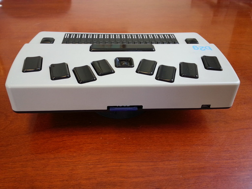

The Back
--------

The SD card slot is the long slot in the middle of the back.
When inserting an SD card, ensure that its pins are facing downward.

A micro USB-B (or device) port is near the left end of the back.
It's primary use is for charging the battery.
The battery can be charged from a computer's USB port.
When inserting the charger cable, ensure that its clips are facing downward.

