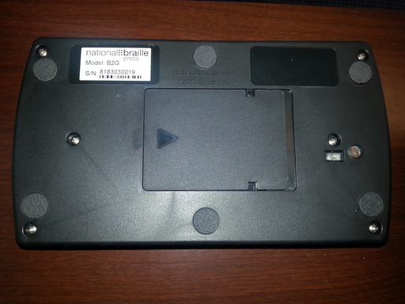
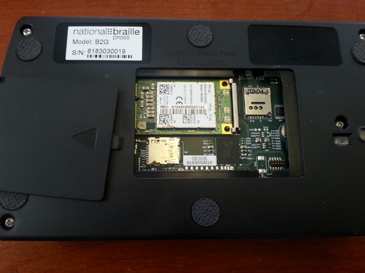

The Bottom
----------

All refreshable braille displays are fragile.
Don't ever put the |product name|, upside down, onto a hard surface.
If you need to turn it over,
e.g. either to press `The Reset Button`_ or to open `The Removable Cover`_,
then first place the |product name| onto a protective, cushion-like surface.

There are six rubber foot pads on the bottom - one at each of the four corners,
one in the middle near the front, and one in the middle near the back.

The camera's lens is within the small, raised circle on the bottom
that's about 2cm (3/4 of an inch) in from the middle of the right side.
The sunken, rectangular window that's a little further in
is where the flash LEDs are.

The Reset Button
~~~~~~~~~~~~~~~~

The Reset button is hidden within a very small, round hole on the 
bottom. If the device is turned over, front to back, the hole is at 
about the eight o'clock position relative to, and very close to, the foot
nearest to the Power switch. A thin, round, blunt-tipped object,
like the end of an unbent paperclip, should be used to press it.

To reset the |product name|, slowly insert the paperclip into the hole,
keeping it almost vertical but leaning slightly toward you.
You should feel a soft click, and also hear a long, high-pitched beep.
You only need to press gently. If it feels like you're pressing
against a hard surface then you've missed the button.

The Removable Cover
~~~~~~~~~~~~~~~~~~~

There's a removable, rectangular, plastic cover in the middle of the 
bottom. To remove it:

1) Turn the device over so that its bottom is on top.

2) Press gently down on the cover, and then slide it toward the side where
   the Power switch is.

3) Lift the end of the cover that's toward the side where the earphone
   jack is.

Be careful after you've removed the cover because the underside of a circuit 
board will be exposed.

Removing the cover is how to gain access to the following:

.. comment

  * The Micro-SD card slot is in the corner that's toward the back and
    toward the side where the earphone jack is. The open end of the slot is
    toward the side where the Power switch is. To insert a card, gently press it
    in until you hear a click. To remove the card, gently press it until you hear
    a click, and then allow the slot's internal spring to push it out.

* The Micro-SIM card slot is in the corner that's toward the front and
  toward the side where the Power switch is. To gain access to the actual slot,
  slide its cover slightly toward the front and then lift the end of it that's
  toward the back. As with most SIM card slot covers, its hinge is fragile so
  be gentle.

* `The Serial Port`_ is in the corner that's toward the back and toward the
  side where the Power switch is. It's a 10-pin (2x5) male connector that
  can be used by the |product name| developers to perform low-level system
  maintenance.

