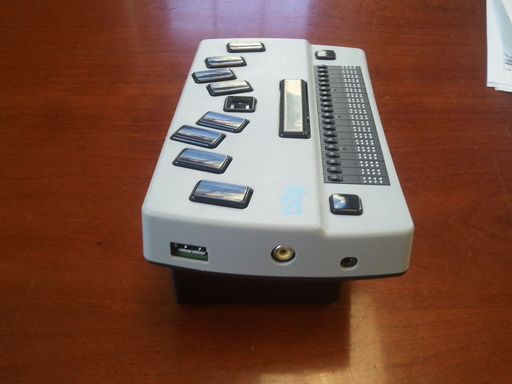

The Left Side
-------------

The headset jack, a 3.5mm OMTP (Open Mobile Terminal Platform) port,
is near the front of the left side. Standard OMTP-compatible earphones,
including those with a microphone, can be used.

The composite video (RCA) jack is in the middle of the left side.
It's for connecting an external video monitor or TV,
and is used for performing diagnostics.
This capability also provides an easy way
for a sighted person to offer direct assistance.

A standard USB-A (or host) port is near the back of the left side. USB 
devices (memory stick, external keyboard, mouse, Ethernet adapter, hub, etc)
can be connected to it. Devices that draw power from the port will drain the
battery so using a powered hub, when possible, should be considered.

