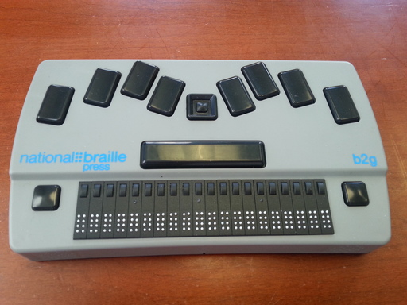
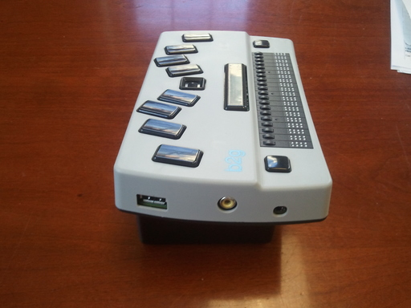
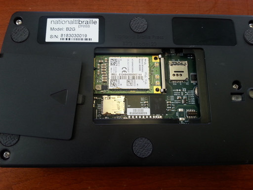

Physical Description
====================

The Top
-------

The eight, rectangular, concave keys (in two groups of four) near the 
back of the top comprise a standard, eight-dot, braille keyboard. The 
four on the left, from left to right, are dots 7, 3, 2, and 1. The four 
on the right, from left to right, are dots 4, 5, 6, and 8.

* The Dot7 key is often referred to as the Backspace key.
* The Dot8 key is often referred to as the Enter key.

The square pad with a small, round button in the middle, in between the Dot1
and Dot4 keys, is the five-key D-Pad (directional pad). Its four edges are the
Up, Down, Left, and Right keys. The button in the middle is the Center
key.

The long, rectangular key in front of the Dot1 key, the D-Pad, and the Dot4 key
is the Space key (or bar).

The braille display (20 eight-dot cells) is at the front of the top. 
There's a small, round button just behind each cell - these are the 
cursor routing keys. The convex, square button to the left of the cursor 
routing keys is the Backward key, and the one to their right is the Forward
key.

The Front
---------

.. image:: b2g-front.jpg
  :align: right
  :alt: [a picture of the front]

Two internal speakers (for the left and right stereo channels) are,
correspondingly, at the left and right ends of the front.

The internal microphone is just behind a very small slit near the bottom,
in the middle of the front.

The Left Side
-------------

The headset jack, a 3.5mm OMTP (Open Mobile Terminal Platform) port,
is near the front of the left side. Standard OMTP-compatible earphones,
including those with a microphone, can be used.

The composite video (RCA) jack is in the middle of the left side.
It's for connecting an external video monitor or TV,
and is used for performing diagnostics.
This capability also provides an easy way
for a sighted person to offer direct assistance.

A standard USB-A (or host) port is near the back of the left side. USB 
devices (memory stick, external keyboard, mouse, Ethernet adapter, hub, etc)
can be connected to it. Devices that draw power from the port will drain the
battery so using a powered hub, when possible, should be considered.

The Right Side
--------------

.. image:: b2g-right.jpg
  :align: right
  :alt: [a picture of the right side]

The volume controls are the two, small, round buttons near the front of 
the right side. The one toward the front is the Volume Down key, and the 
one toward the back is the Volume Up key. These keys, when pressed on their
own, adjust the volume of the current Android audio stream.

The Power Switch
~~~~~~~~~~~~~~~~

The Power switch is the slide switch near the back of the right side. 
It's **off** position is toward the front, and its **on** position is 
toward the back.

If the system is shut down, then:

* Switching it on boots the device. You should hear one short beep. If,
  instead, you hear three short beeps then the battery is too low and the
  device won't boot. In this case, switch it back off, and then charge the
  battery for a while before trying again.

* Switching it on while holding VolumeDown boots the device into `Recovery Mode`_.

If the system is running, then:

* Switching it off puts the system to sleep.

* Switching it on wakes the system up.

When the system is either booted or woken up, the following settings are reset
to their default values:

* The typing mode is set to Text (see `Typing Modes`_).
* Highlighted typing is turned off (see `Typing Highlighted Characters`_).
* The braille display is enabled (see `Disabling the Display`_).

The Back
--------

.. image:: b2g-back.jpg
  :align: right
  :alt: [a picture of the back]

The SD card slot is the long slot in the middle of the back.

A micro USB-B (or device) port is near the left end of the back. It's 
primary use is for charging the battery. The battery can be charged from 
a computer's USB port.

The Bottom
----------

.. image:: b2g-bottom.jpg
  :align: right
  :alt: [a picture of the bottom]

All refreshable braille displays are fragile.
Don't ever put the |product name|, upside down, onto a hard surface.
If you need to turn it over,
e.g. either to press `The Reset Button`_ or to open `The Removable Cover`_,
then first place the |product name| onto a protective, cushion-like surface.

There are six rubber foot pads on the bottom - one at each of the four corners,
one in the middle near the front, and one in the middle near the back.

The camera's lens is within the small, raised circle on the bottom
that's about 2cm (3/4 of an inch) in from the middle of the right side.
The sunken, rectangular window that's a little further in
is where the flash LEDs are.

The Reset Button
~~~~~~~~~~~~~~~~

The Reset button is hidden within a very small, round hole on the 
bottom. If the device is turned over, front to back, the hole is at 
about the eight o'clock position relative to, and very close to, the foot
nearest to the Power switch. A thin, round, blunt-tipped object,
like the end of an unbent paperclip, should be used to press it.

To reset the |product name|, slowly insert the paperclip into the hole,
keeping it almost vertical but leaning slightly toward you.
You should feel a soft click, and also hear a long, high-pitched beep.
You only need to press gently. If it feels like you're pressing
against a hard surface then you've missed the button.

The Removable Cover
~~~~~~~~~~~~~~~~~~~

There's a removable, rectangular, plastic cover in the middle of the 
bottom. To remove it:

1) Turn the device over so that its bottom is on top.

2) Press gently down on the cover, and then slide it toward the side where
   the Power switch is.

3) Lift the end of the cover that's toward the side where the earphone
   jack is.

Be careful after you've removed the cover because the underside of a circuit 
board will be exposed.

Removing the cover is how to gain access to the following:

.. comment

  * The Micro-SD card slot is in the corner that's toward the back and
    toward the side where the earphone jack is. The open end of the slot is
    toward the side where the Power switch is. To insert a card, gently press it
    in until you hear a click. To remove the card, gently press it until you hear
    a click, and then allow the slot's internal spring to push it out.

* The Micro-SIM card slot is in the corner that's toward the front and
  toward the side where the Power switch is. To gain access to the actual slot,
  slide its cover slightly toward the front and then lift the end of it that's
  toward the back. As with most SIM card slot covers, its hinge is fragile so
  be gentle.

* `The Serial Port`_ is in the corner that's toward the back and toward the
  side where the Power switch is. It's a 10-pin (2x5) male connector that
  can be used by the |product name| developers to perform low-level system
  maintenance.

