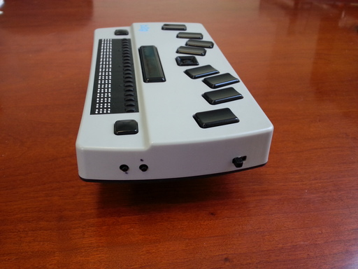

The Right Side
--------------

The volume controls are the two, small, round buttons near the front of 
the right side. The one toward the front is the Volume Down key, and the 
one toward the back is the Volume Up key. These keys, when pressed on their
own, adjust the volume of the current Android audio stream.

The Power Switch
~~~~~~~~~~~~~~~~

The Power switch is the slide switch near the back of the right side. 
It's **off** position is toward the front, and its **on** position is 
toward the back.

If the system is shut down, then:

* Switching it on boots the device. You should hear one short beep. If,
  instead, you hear three short beeps then the battery is too low and the
  device won't boot. In this case, switch it back off, and then charge the
  battery for a while before trying again.

* Switching it on while holding VolumeDown boots the device into `Recovery Mode`_.

If the system is running, then:

* Switching it off puts the system to sleep.

* Switching it on wakes the system up.

When the system is either booted or woken up, the following settings are reset
to their default values:

* The braille display is enabled (see `Disabling the Display`_)
  if `speech`_ is disabled.

* The typing mode is set to Regular Text (see `Typing Modes`_).

* Highlighted typing is turned off (see `Typing Highlighted Characters`_).

