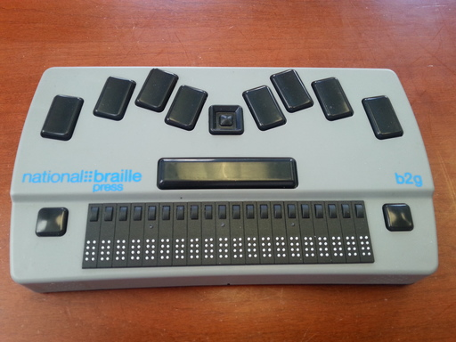

The Top
-------

The eight, rectangular, concave keys (in two groups of four) near the 
back of the top comprise a standard, eight-dot, braille keyboard. The 
four on the left, from left to right, are dots 7, 3, 2, and 1. The four 
on the right, from left to right, are dots 4, 5, 6, and 8.

* The Dot7 key is often referred to as the Backspace key.
* The Dot8 key is often referred to as the Enter key.

The square pad with a small, round button in the middle, in between the Dot1
and Dot4 keys, is the five-key D-Pad (directional pad). Its four edges are the
Up, Down, Left, and Right keys. The button in the middle is the Center
key.

The long, rectangular key in front of the Dot1 key, the D-Pad, and the Dot4 key
is the Space key (or bar).

The braille display (20 eight-dot cells) is at the front of the top. 
There's a small, round button just behind each cell - these are the 
cursor routing keys. The convex, square button to the left of the cursor 
routing keys is the Backward key, and the one to their right is the Forward
key.

